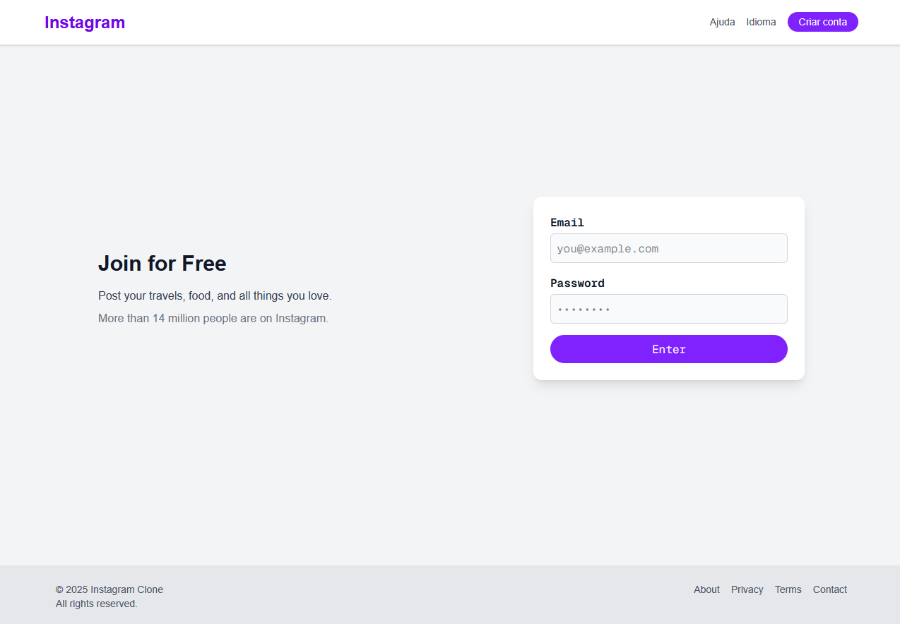
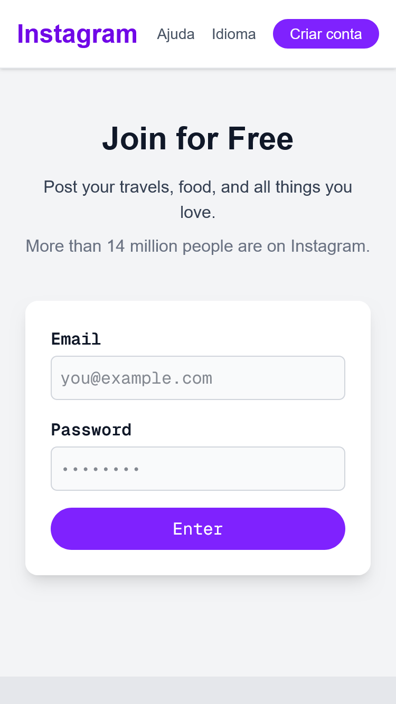
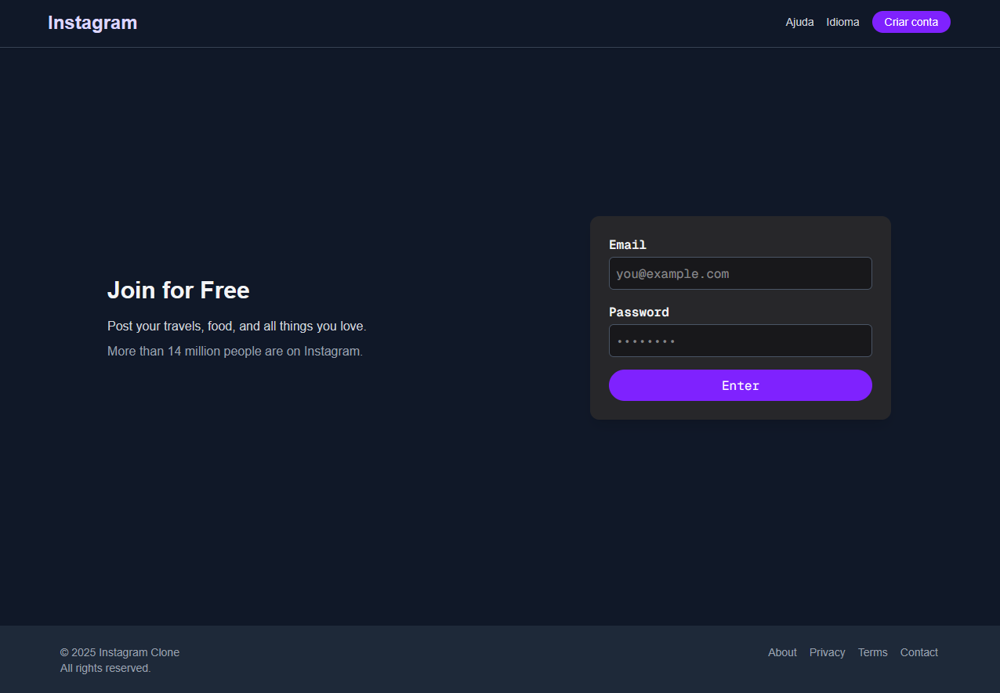
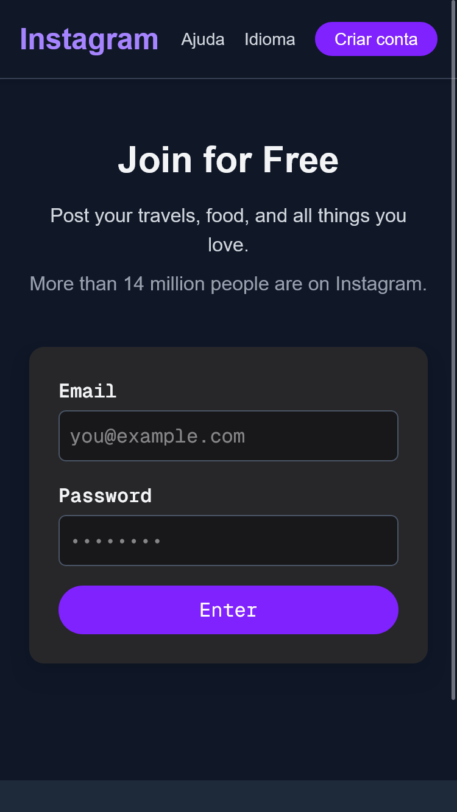

# Instagrama

Clone de uma tela de login inspirado em redes sociais modernas, como Instagram e Facebook.  
Este projeto foi desenvolvido com o framework **Next.js** e estilizado com **Tailwind CSS**, oferecendo suporte completo a **modo claro e escuro**. A proposta é demonstrar boas práticas de desenvolvimento front-end com foco em design moderno, responsividade e acessibilidade.

---

## 📑 Tabela de Conteúdos
<!--ts-->
* [📌 Sobre](#sobre)
  * [💡 Conceitos aplicados](#conceitos-aplicados)
  * [🖼️ Screenshots](#screenshots)
* [🚀 Instalação](#instalação)
* [🛠 Tecnologias utilizadas](#tecnologias-utilizadas)
<!--te-->

---

## 📌 Sobre

O **Instagrama** é uma interface de tela de login responsiva que simula o ambiente visual de grandes redes sociais. 

Ideal para praticar e demonstrar:

- Design de UI moderno com Tailwind;
- Alternância de temas (light/dark mode);
- Estrutura de projeto com Next.js;
- Organização semântica e acessível de layout;
- Uso de componentes reutilizáveis e boas práticas de React/JSX.

---

## 💡 Conceitos aplicados

- 🧱 **Componentização**: separação clara entre header, main e footer;
- 🌗 **Modo escuro/claro**: usando utilitários `dark:` do Tailwind CSS;
- 🧭 **Responsividade**: layout adaptado para diferentes tamanhos de tela;
- 🔒 **Acessibilidade**: uso correto de `label`, `htmlFor`, placeholders e `type="password"`;
- 🎨 **Design moderno**: cores suaves, tipografia legível e hierarquia visual clara;
- 📄 **Semântica HTML5**: uso de `<header>`, `<main>`, `<section>`, `<footer>`.

---

## 🖼️ Screenshots

### Modo Claro




### Modo Escuro



---

## 🚀 Instalação

Para rodar este projeto localmente, siga os passos abaixo:

### 1. Clone o repositório

```bash
git clone https://github.com/Taunt-byte/Instagram-Login-Page.git
cd client
```

### 2. Instale as dependências

```bash
npm install
```

### 3. Inicie o servidor de desenvolvimento

```bash
npm run dev
```

Acesse [http://localhost:3000](http://localhost:3000) para visualizar no navegador.

---

## 🛠 Tecnologias utilizadas

* [Next.js](https://nextjs.org/) — Framework React com SSR/SSG;
* [React](https://reactjs.org/) — Biblioteca de interface declarativa;
* [Tailwind CSS](https://tailwindcss.com/) — Framework utilitário de CSS moderno;
* [Vercel](https://vercel.com/) — Hospedagem e deploy para apps Next.js.

---

Feito com Lucas Neves

[LinkedIn](https://www.linkedin.com/) | [GitHub](https://github.com/)